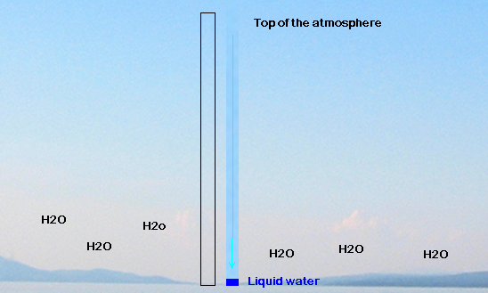

		<h2>Introduction</h2>

    <h3>What is Precipitable Water?</h3>
    Precipitable water is the amount of condensed water vapor to be found in a vertical column of air, with a base of 1 meter-squared, that 
    extends from the surface of the Earth to the top of the atmosphere. 
      
    </img>
     
    <i><b>Figure 1:</b> Schematic illustrating the concept of precipitable water. The left column contains air and water vapour, 
        the right column contains dry air and condensed water vapour on the bottom of the column <a href="#references">[1]</a>.
    </i>
      
    Precipitable water is important because:
    <ul>
        <li> Energy is transferred from the surface to the atmosphere via water vapor, and is released as latent heat. Precipitable water helps
     us determine the amount of energy in the atmosphere. </li>
        <li> Weather forecasting models can use precipitable water data to determine the likelihood of storms, hail, and other major meteorological 
        events. </li> 
        <li> The relationship between air temperature and the amount of water vapor is linear. Therefore, precipitable water measurements can be
        used to determine temperature increases at higher altitudes.
    </ul>
	<h3>Goal</h3>
	The goal of this project is to determine the correlation between
	zenith sky temperature and precipitable water. This experiment
	is based off of a similar study conducted by Mims et al [2]. 
	We endeavor to develop a methodology and data 
	source that is more rigorous, more accessible, and more easily repeatable across a variety of climate zones.
	<h3>Intstrumentation</h3>
    </img>
         
	This experiment used three infrared sensors <i>(from left to right)</i>:
	<ol>
		<li>1610 TE</li>
		<li>FLIR i3</li>
		<li>AMES</li>
	</ol>
	The purpose of these sensors is to measure the thermal energy of a
	given area in the atmosphere. The area is determined by the Distance to
	Spot ratio. 
	  
    When using the model for your analysis, take the time to fully complete the 
    <code>instruments.txt</code>
	file with the appropriate information. This will assure that the data
	properly corresponds to the labels of the sensors. If there is an entry
	that you are unable to fill, please use NA as a filler. More information 
	regarding the different columns of the <code>instruments.txt</code> will
	be discussed in the Data Format section of this documentation page.

	<h2>Methodology</h2>

    <h3>Setting Guidelines</h3>
    <ol>
        <li>Determine the Scope of the project </li>
        <li>
        <li>
        <li>
        <li> 
    </ol>

	<h2>Data Format</h2>

Using pattern identification, the data format is flexible with few strict requirements. 

	<h2>Requirements</h2>

To satisfy the requirements to execute the script. Run <code>install.sh</code>. 
It will install the system requirements and the R package 
requirements.

<pre lang="bash">
<code>
<inp>$</inp> bash setup.sh
</code>
</pre>

	<h2>Overview of the Model</h2>

<b>Please read this section before using the script</b>
 
The computational model is enclosed in the script <code>model.r</code>. 
Some of the plot sets are divided into two subcategories: clear sky and overcast. 
This division is used to isolate data where clouds may have interfered with the temperature
measurement. To access the overcast subcategory use the <code>--overcast</code> or <code>-o</code> 
argument.
  

<pre lang="bash">
<code>
<inp>$</inp> Rscript model.r --help

usage: model.r [-h] [--save] [--set SET] [--poster] [--dev] [-d] [-o] [-1st] 
               [-i] [-ml]

optional arguments:
  -h, --help          Show this help message and exit
  --save              Saves plots
  --set SET           Select plot sets: 
                          [t]ime series
                          [a]nalytics
                          [c]harts
                          [i]ndividual sensors
  --poster            Produces poster plots
  --dev               Development plots
  -d, --data          Produces two columned dataset including mean temp and PW
  -o, --overcast      Shows time series data for days with overcast condition
	                  (Used with --set [t/a/i])
  -1st, --first_time  Notes for first time users.
  -i, --instrument    Prints out sensor data stored in instruments.txt
</code>
</pre>

<h3> 'Time Series' Set Contents </h3>
<pre lang="bash">
<code>
<inp>$</inp> Rscript model.r --set t
<inp>$</inp> Rscript model.r --set t --overcast
</code>
</pre>
<ol>
	<li> Air Temperature Time Series </li>
	<li> Ground Temperature Time Series </li>
	<li> Change in Temperature Time Series </li>
    <li> Precipitable Water Time Series </li>
    <li> Sky Temperature - Precipitable Water Time Series </li>
    <li> Temporal Mean Precipitable Water Time Series </li>
    <li> Locational Mean Precipitable Water Time Series </li>
    <li> Mean Precipitable Water Time Series </li>
   
</ol>

<h3> 'Analytics' Set Contents </h3>
<pre lang="bash">
<code>
<inp>$</inp> Rscript model.r --set a
<inp>$</inp> Rscript model.r --set a --overcast
</code>
</pre>

<ol>
	<li> Individual Location PW and Temperature </li>
	<li> Locational Average PW and Temperature </li>
	<li> Total Mean PW and Temperature </li>
	<li> Residual for Total Mean PW and Temperature</li>
</ol>

<h3> 'Charts' Set Contents </h3>

<pre lang="bash">
<code>
<inp>$</inp> Rscript model.r --set c
</code>
</pre>

<ol>
	<li> Overcast Condition Percentage (Bar) </li>
</ol>

<h3> 'Individual Sensors' Set Contents </h3>

<pre lang="bash">
<code>
<inp>$</inp> Rscript model.r --set i
<inp>$</inp> Rscript model.r --set i --overcast
</code>
</pre>

<ol>
	<li> Sky and Ground Temperature Time Series for each sensor</li>
</ol>

<h3> Step-by-Step usage (Linux)</h3>
<table class="usage">
<tbody>
<tr style="border: 0px;">
	<td>
		1
	</td>
	<td>
		Fork, Clone, or Download the repository. 
	</td>
</tr>
<tr>
	<td>
		2
	</td>
	<td>
		In your terminal inside of project directory run
		<code>bash install.sh</code>.
	</td>
</tr>
<tr>
	<td>
		3
	</td>
	<td>
		Update <code>instruments.txt</code>with the appropriate
		sensor information. 
	</td>
</tr>
<tr>
	<td>
		4
	</td>
	<td>
		Update <code>master_data.csv</code> with your collected
		data following the format earlier defined in 
		<a href="#data">Data Format</a>. </li>
	</td>
</tr>
<tr style="border: 0px;">
	<td>
		5
	</td>
	<td>
		To view the plots see the above subsections for 
		the appropriate command line arguments. </li>
	</td>
</tr>
</tbody>
</table>

<h2>Contributing to the Research</h2>

If you would like to contribute to this project, visit our <a href="./contrib.html">contribution page</a>.

<h2>Next Steps</h2>

The future development of this project with regards to the data collection include 

    <h2>Resources</h2>

    <ul>
        <li><a href="http://weather.uwyo.edu/upperair/sounding.html" target="_blank">Wyoming Sounding Data</a></li>
    </ul>

    <h2>References</h2>

